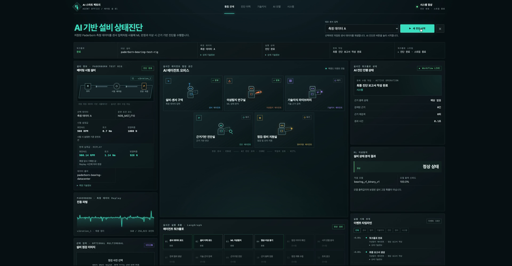
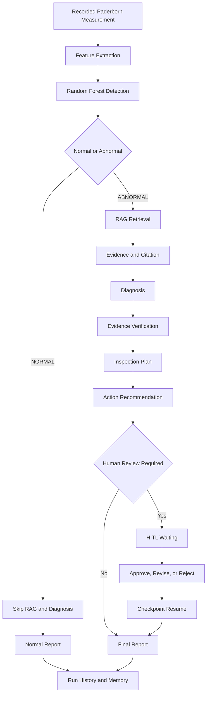

# AI Smart Factory Agent Office

저장된 제조설비 측정 데이터를 ML로 분석하고, 기술문서 Evidence를 이용해 진단·점검·조치 권고까지 연결하는 **Evidence-grounded AI Agent MVP**입니다.

**Team: Codyssey AI Factory**

> 현재 입력은 Paderborn의 저장 Measurement Replay입니다. 실제 공장 센서의 연속 수집이나 PLC 자동제어 기능은 포함하지 않습니다.



## 1. Problem

제조설비 이상이 발견된 뒤 기술문서 검색, 원인 검토, 점검 계획 작성, 조치 판단이 서로 분리되어 있으면 담당자의 경험과 반복적인 수작업에 크게 의존합니다. 판단 근거와 실행 이력을 함께 추적하기도 어렵습니다.

## 2. Solution

AI Smart Factory Agent Office는 하나의 Measurement에서 다음 흐름을 연결합니다.

- 저장 신호 Replay와 Feature Extraction
- Random Forest 정상·손상 분류
- 손상 경로의 RAG 기술 근거 검색
- Evidence 기반 진단과 근거 충족 검증
- 점검 계획과 조치 권고
- 중요 조치의 Human-in-the-Loop 검토
- Final Report, Run History, Checkpoint, Equipment Memory 저장
- AgentEvent SSE 기반 진행 상태 표시

## 3. End-to-End Agent Workflow



## 4. Representative Scenarios

| 시나리오 | 실제 입력 | 검증 경로 |
|---|---|---|
| A · 정상 | `paderborn:K001:N09_M07_F10:01` | ML `normal` → RAG 생략 → Normal Report → `COMPLETED` |
| B · 손상 | `paderborn:KA01:N09_M07_F10:01` | ML `abnormal` → RAG → Evidence → Diagnosis → Inspection → Action → Final Report |
| C · HITL 시연 | `paderborn:KA01:N09_M07_F10:02` + `HITL_CONTROLLED` | 실제 Measurement와 ML·RAG를 사용하고, 공개된 통제 조건으로 중요 조치 검토를 발생시켜 `WAITING → Human Input → Resume → COMPLETED`를 확인 |

시나리오 C의 통제 조건은 HITL과 Checkpoint Resume 시연용입니다. 설비 정지 명령을 실행하거나 원본 Measurement의 정답을 변경하지 않습니다.

## 5. AI Agent 6 Elements

| 요소 | 현재 구현 |
|---|---|
| Goal | Measurement를 분석하고 추적 가능한 진단 지원 보고서를 완성합니다. |
| Planning | `backend/app/agent/graph.py`의 LangGraph node와 conditional edge가 실행 순서를 결정합니다. |
| Reasoning | `backend/app/agent/reasoning.py`가 Evidence 기반 후보와 검증 결과를 구조화합니다. |
| Tool Use | Paderborn Adapter, ML inference, Chroma retrieval, Vision observation, Memory repository를 호출합니다. |
| Memory | Run/Event DB, LangGraph Checkpoint, Equipment Memory를 목적별 SQLite 저장소에 분리합니다. |
| Feedback | Evidence 재검색, 추가정보 요청, HITL 승인·수정·거절, SSE 상태 갱신을 다음 상태에 반영합니다. |

현재 검증된 핵심 경로는 외부 LLM의 자유 생성에 의존하지 않고 결정론적 reasoner와 planner를 사용합니다.

## 6. Architecture

```text
Next.js Frontend
  └─ REST / SSE
FastAPI Backend
  ├─ Paderborn Data Adapter / Replay API
  ├─ Feature Pipeline / Random Forest
  ├─ RAG / Chroma / Evidence
  ├─ LangGraph / HITL / Checkpoint
  ├─ Run History / Equipment Memory
  └─ Optional Vision Observation

Storage
  ├─ Model artifact and evaluation files
  ├─ Chroma vector collection
  └─ Run, Checkpoint, Memory, Vision SQLite stores
```

Source of truth는 Measurement Adapter, `AnalysisResult`, `EvidenceObject`, LangGraph `AgentState`, Equipment Memory, `VisualObservation`, persisted Run/Event로 분리되어 있습니다.

## 7. Technology Stack

| 영역 | 기술 |
|---|---|
| Backend | Python 3.11+, FastAPI, Pydantic, Uvicorn |
| ML | scikit-learn, RandomForestClassifier, NumPy, SciPy, joblib |
| Agent | LangGraph 1.2.x |
| RAG | Chroma 1.x, local HashingVectorizer |
| Storage | SQLite, Chroma persistence |
| Frontend | Next.js 16.3.5, React 19, TypeScript 5.9 |
| Test | pytest, Node test runner, TypeScript compiler, Next.js production build |

정확한 Python 호환 범위는 [backend/requirements.txt](backend/requirements.txt), Frontend 버전은 [frontend/package.json](frontend/package.json)을 기준으로 합니다.

## 8. Data

- Source: [Paderborn University Bearing DataCenter](https://mb.uni-paderborn.de/en/kat/research/bearing-datacenter)
- Official dataset page: [Data Sets and Download](https://mb.uni-paderborn.de/en/kat/research/bearing-datacenter/data-sets-and-download)
- Official download index: [KAt BearingDataCenter](https://groups.uni-paderborn.de/kat/BearingDataCenter/)
- 현재 대표 subset: `K001`, `KA01`, `KI01`
- Measurement: 240건
- Class: healthy 80건, damaged 160건
- 채널: `vibration_1`, `phase_current_1`, `phase_current_2`, `speed`, `torque`, `force`, temperature metadata
- UI Replay: 저장된 MAT 신호와 운전값을 동일 normalized timeline에서 재생

Paderborn Dataset과 Dataset에 포함된 Fact Sheet·Measurement Log는
[CC BY-NC 4.0](https://creativecommons.org/licenses/by-nc/4.0/) 조건을 따릅니다.
비상업적 이용과 재배포에는 출처표시, 라이선스 링크, 변경 여부 표시가 필요하며,
상업적 이용은 Paderborn University 측의 별도 허가를 확인해야 합니다.

원본 RAR/MAT 학습데이터는 저장소에 포함하지 않습니다. 공식 원본에서 로컬로 내려받는
방법은 [Setup](#16-setup), 상세한 출처·재배포 범위는
[Sources / Attribution](#21-sources--attribution)을 참조하십시오. 현장 Sensor, MQTT,
OPC-UA, API 입력이 확보되면 Measurement Adapter 앞단을 교체·확장할 수 있으나,
해당 실시간 수집기는 현재 구현되어 있지 않습니다.

## 9. ML

| 항목 | 현재 값 |
|---|---|
| Model ID | `bearing_rf_binary_v1` |
| Algorithm | `RandomForestClassifier` v1.0 |
| Input | 3개 신호 채널에서 추출한 36개 Feature |
| Window | 1초, overlap 0% |
| Split | Measurement ID 기준 stratified group split |
| Train / Test | 180 / 60 Measurements, 718 / 239 Windows |

현재 test split의 Accuracy와 F1은 1.0이지만, 세 Bearing ID가 train/test 양쪽에 모두 포함되어 있습니다. 따라서 이는 대표 subset 내부 재현 결과이며 unseen-bearing 또는 현장 일반화 성능 100%를 의미하지 않습니다. UI confidence 역시 calibration을 거친 실제 고장 확률이 아닙니다.

## 10. RAG / Knowledge

| 항목 | 현재 값 |
|---|---|
| Knowledge Pack | `bearing_v1` v1.0 |
| Documents | 15 |
| Chunks / Embeddings | 183 / 183 |
| Vector DB | Chroma, collection `bearing_v1` |
| Embedding | `sklearn-hashing-vectorizer-v1` |
| Dimension / Distance | 384 / cosine |

검색 결과는 문서명, 발행기관, 페이지, 섹션과 함께 `EvidenceObject`로 변환됩니다. UI의 검색 점수는 `1 - cosine distance` 기반 상대 순위 신호이며 정답 확률이나 진단 신뢰도가 아닙니다.

## 11. Human-in-the-Loop

`SHUTDOWN_CHECK`, `SCHEDULE_MAINTENANCE`, 또는 High priority 조치는 사람 검토가 필요하도록 정책이 적용됩니다.

```text
RUNNING → WAITING → Human decision → RUNNING → COMPLETED
```

Backend는 `POST /api/v1/agent/runs/{run_id}/human-input`으로 승인·수정 요청·거절을 받고, 동일 `run_id`와 LangGraph thread의 Checkpoint에서 Workflow를 재개합니다. 추가 정보가 필요한 경우에도 별도의 Human Request로 일시정지합니다.

## 12. Safety

- No direct PLC control
- No automatic equipment shutdown
- No interlock bypass
- No automatic maintenance execution
- 중요한 권고는 Human Approval이 필요할 수 있음

본 시스템은 설비 자동제어가 아닌 **의사결정 지원 시스템**입니다.

## 13. Traceability

Run, ordered Agent Event, Human Request, Evidence/Citation, LangGraph Checkpoint, Equipment Memory, Vision metadata, Final Report를 분리 저장합니다. 진단 이력 조회는 Workflow를 다시 실행하거나 Memory를 추가하지 않고 저장된 상태와 보고서를 복원합니다. SSE는 센서 스트리밍이 아니라 Agent Event 진행 상태를 전달합니다.

## 14. Existing Assets vs New Development

### External / Existing Assets

- Paderborn Bearing DataCenter Dataset 및 관련 공식 자료
- SKF 기술문서 원문
- Python, FastAPI, scikit-learn, LangGraph, Chroma, SQLite
- Next.js, React, TypeScript

### Newly Developed for This Project

- Paderborn Measurement Adapter와 저장 신호 Replay
- 36-Feature pipeline 연동과 ML inference service
- Knowledge manifest, ingestion, retrieval, Evidence traceability
- LangGraph 진단 Workflow와 bounded retry
- Diagnosis, Evidence Verification, Inspection Plan, Action Recommendation
- HITL policy, Human Request, Checkpoint Resume
- Equipment Memory, Run History, AgentEvent SSE
- Agent Office와 History / Knowledge / Model / System 화면
- 선택형 이미지 품질 관찰과 센서·RAG Evidence 분리

오픈소스 프레임워크 자체는 신규 개발분으로 주장하지 않습니다.

## 15. Project Structure

```text
backend/              FastAPI, ML, RAG, Agent, Memory, Vision, tests
frontend/             Next.js application and frontend tests
config/               frozen MVP interface and demo scenarios
data/                 dataset metadata and local raw-data location
knowledge/            source manifest and local knowledge locations
artifacts/ml/         active model and evaluation artifacts
artifacts/rag/        bounded RAG evaluation artifacts
artifacts/ui/         demo screenshots
docs/competition/     competition reports and evidence documents
scripts/              acquisition, ingestion, evaluation, verification tools
```

## 16. Setup

### Prerequisites

- Python 3.11+
- Node.js 20+
- npm 10+
- Paderborn/SKF 공식 자료 다운로드를 위한 인터넷 연결
- RAR 추출이 가능한 로컬 도구

### Environment and source preparation

저장소 루트에서 실행합니다.

대표 학습데이터 3종(`K001`, `KA01`, `KI01`)과 RAG 문서를 함께 내려받고 압축을 해제합니다.

```bash
cp .env.example .env
python3 scripts/download_project_sources.py --dataset sample --extract
```

필요한 자산만 내려받으려면 다음 명령을 사용합니다.

```bash
# RAG 문서만 다운로드
python3 scripts/download_project_sources.py --dataset none

# 대표 학습데이터 3종만 다운로드·압축 해제
python3 scripts/download_project_sources.py --dataset sample --skip-documents --extract

# 전체 Paderborn 학습데이터 32종만 다운로드·압축 해제
python3 scripts/download_project_sources.py --dataset all --skip-documents --extract
```

다운로드 스크립트는 아래 공식 배포처만 사용합니다.

- Paderborn Dataset: <https://groups.uni-paderborn.de/kat/BearingDataCenter/>
- Paderborn Dataset 안내: <https://mb.uni-paderborn.de/en/kat/research/bearing-datacenter/data-sets-and-download>
- Paderborn Benchmark Paper: <https://mb.uni-paderborn.de/fileadmin-mb/kat/PDF/Veroeffentlichungen/20160703_PHME16_CM_bearing.pdf>
- SKF 문서 URL과 파일별 조건: [Source Manifest](knowledge/bearing_v1/manifests/SOURCE_MANIFEST.md)

원본 RAR/MAT, 다운로드한 웹페이지·외부 기술문서 및 생성된 Chroma Vector DB는 로컬에서만
사용하고 Git에 포함하지 않습니다. Paderborn 압축파일에서 추출한 소형 Fact Sheet와
Measurement Log PDF만 원본 그대로 저장소에 포함하며, CC BY-NC 4.0 조건을 유지합니다.

### Backend

```bash
cd backend
python3 -m venv .venv
source .venv/bin/activate
python -m pip install -r requirements.txt
cd ..
backend/.venv/bin/python scripts/ingest_knowledge_pack.py --pack bearing_v1
```

활성 Random Forest artifact는 `artifacts/ml/baseline_v1/model.joblib`에 포함됩니다. 직접 재학습하려면 [data/paderborn/README.md](data/paderborn/README.md)의 절차를 따릅니다.

### Frontend

```bash
cd frontend
cp .env.local.example .env.local
npm ci
```

## 17. Run

터미널 1:

```bash
cd backend
.venv/bin/uvicorn app.main:app --host 127.0.0.1 --port 8000
```

터미널 2:

```bash
cd frontend
npm run dev
```

- UI: <http://localhost:3000>
- Backend health: <http://localhost:8000/api/v1/health>
- OpenAPI: <http://localhost:8000/docs>

## 18. Test

```bash
cd backend
.venv/bin/pytest -q
```

```bash
cd frontend
npm test
npm run lint
npm run build
```

2026-10-01 현재 검증 결과:

- Backend: 163 passed
- Frontend: 28 passed
- TypeScript: passed
- Next.js production build: passed, 7 routes
- Runtime A/B/C: 모두 `COMPLETED`, Final Report 복원 가능

세부 증빙은 [TEST_RESULTS.md](docs/competition/TEST_RESULTS.md)를 참조합니다.

## 19. Known Limitations

- Recorded Data 기반이며 실제 공장 Sensor Streaming이 아닙니다.
- 세 Bearing ID가 train/test에 공유되어 unseen-bearing generalization은 검증되지 않았습니다.
- HashingVectorizer는 다국어 semantic embedding이 아니며 사용자 한국어 검색만 제한적 규칙 기반 영문 query로 변환합니다.
- Vision provider는 해상도·밝기·대비·사용 가능성을 관찰하며 고장 판독 모델이 아닙니다.
- 실제 PLC 제어, 자동 설비 정지, 정비 실행 기능이 없습니다.
- 원본 Dataset, 저작권 기술문서, Chroma index와 Runtime DB는 Git에 포함하지 않습니다.

## 20. Competition Documents

- [개발완료보고서](docs/competition/development_completion_report.md)
- [AI Agent 기술설명서](docs/competition/agent_technical_description.md)
- [구현 감사 결과](docs/competition/implementation_audit.md)
- [출처 및 AI 활용 내역](docs/competition/SOURCES_AND_AI_USAGE.md)
- [테스트 결과](docs/competition/TEST_RESULTS.md)

## 21. Sources / Attribution

### External data and documents

| 자산 | 공식 출처 | 라이선스·저장소 정책 |
|---|---|---|
| Paderborn Measurement Dataset | [Bearing DataCenter](https://mb.uni-paderborn.de/en/kat/research/bearing-datacenter), [공식 다운로드](https://groups.uni-paderborn.de/kat/BearingDataCenter/) | [CC BY-NC 4.0](https://creativecommons.org/licenses/by-nc/4.0/). 원본 RAR/MAT는 Git 제외 |
| Paderborn Fact Sheet / Measurement Log | Dataset 공식 압축파일에 포함 | CC BY-NC 4.0. `data/paderborn/docs/`의 PDF는 원본에서 수정하지 않은 파일이며 프로젝트 코드와 별도 라이선스 적용 |
| Paderborn Benchmark Paper | [Official PDF](https://mb.uni-paderborn.de/fileadmin-mb/kat/PDF/Veroeffentlichungen/20160703_PHME16_CM_bearing.pdf) | 문서에 표시된 별도 CC Attribution 조건 적용. 로컬 다운로드만 허용하고 Git 제외 |
| Paderborn 공식 웹페이지 | [Bearing DataCenter](https://mb.uni-paderborn.de/en/kat/research/bearing-datacenter) | 웹페이지 재배포 조건이 별도로 확인되지 않아 로컬 다운로드만 허용하고 Git 제외 |
| SKF 기술문서 | [파일별 공식 URL과 조건](knowledge/bearing_v1/manifests/SOURCE_MANIFEST.md) | SKF 저작권 자산. 재배포 권한이 확인되지 않아 로컬 다운로드만 허용하고 Git 제외 |

### Required Paderborn attribution

이 저장소에 포함된 Paderborn Dataset 파생 자료와 Fact Sheet·Measurement Log의 출처는
다음과 같습니다.

> Christian Lessmeier et al., KAt-DataCenter, Chair of Design and Drive
> Technology, Paderborn University,
> <https://mb.uni-paderborn.de/en/kat/research/bearing-datacenter>

- License: [Creative Commons Attribution-NonCommercial 4.0 International](https://creativecommons.org/licenses/by-nc/4.0/)
- Included PDF changes: none; files were copied unchanged from the official Dataset archives.
- Commercial use: contact Paderborn University / the Dataset author before use.

Dataset, 기술문서, 오픈소스 라이브러리, AI 개발도구의 파일별 출처·사용 범위·체크섬은
[SOURCES_AND_AI_USAGE.md](docs/competition/SOURCES_AND_AI_USAGE.md)와
[canonical source manifest](knowledge/bearing_v1/manifests/source_manifest.json)에 정리했습니다.
외부 자산에는 각 권리자의 라이선스와 이용조건이 계속 적용됩니다. 이 저장소에는 현재
프로젝트 전체에 적용되는 별도 오픈소스 라이선스가 선언되어 있지 않으므로, 저장소 공개가
프로젝트 코드의 자유로운 복제·재사용을 허가한다는 의미는 아닙니다.
