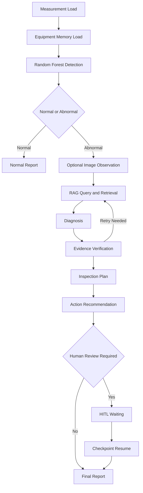

# AI Agent 기술설명서

## 1. Goal

AI Smart Factory Agent Office는 저장된 베어링 Measurement를 분석해 정상·손상을 분류하고, 손상 경로에서는 승인된 기술문서 Evidence를 이용해 진단 후보, 점검 계획, 조치 권고, Final Report를 만드는 의사결정 지원 Agent입니다. 설비 자동제어는 수행하지 않습니다.

## 2. Workflow

실제 graph는 `backend/app/agent/graph.py`의 25개 Backend node로 구성되고, Frontend는 이를 사용자용 13단계로 묶어 표시합니다.

## 3. AI

- ML: `bearing_rf_binary_v1`, `RandomForestClassifier` v1.0
- Input: `vibration_1`, `phase_current_1`, `phase_current_2`에서 추출한 36개 Feature
- RAG: 15 Documents, 183 Chunks/Embeddings, Chroma `bearing_v1`, 384차원 HashingVectorizer
- Reasoning: 구조화된 Evidence를 사용하는 결정론적 diagnosis/evidence verification/action planner
- Vision: 이미지 품질과 관찰 가능성만 기록하는 `pillow-quality-observer-v1`; 고장 판독 모델이 아님

현재 핵심 경로는 외부 LLM API를 호출하지 않습니다. 모델 지표 1.0은 대표 subset 내부 결과이며 unseen-bearing 성능이나 현장 정확도 100%를 뜻하지 않습니다.

## 4. Tool / API / Data

| 구분 | 실제 연결 |
|---|---|
| Data Tool | Paderborn MAT Adapter와 Measurement Preview API |
| ML Tool | Feature Pipeline과 model registry/inference service |
| Knowledge Tool | purpose별 QueryBuilder, Chroma retrieval, `EvidenceObject` 변환 |
| Memory Tool | Equipment Memory read/write와 Run History |
| Human Tool | Human Request, `/human-input`, LangGraph interrupt/resume |
| Observation Tool | 선택형 inspection image 저장과 quality observation |
| Feedback Channel | ordered AgentEvent와 SSE reconnect |

현재 데이터는 K001, KA01, KI01의 240개 저장 Measurement입니다. SSE는 Agent Event Streaming이며 실제 Sensor Streaming이 아닙니다.

## 5. Memory

- Run/Event DB: 실행 상태, 순서화 이벤트, Human Request 결과
- LangGraph Checkpoint: `run_id`와 같은 thread ID로 중단·재개 상태 보존
- Equipment Memory: 완료 결과와 명시적으로 제출된 설비 이력 저장
- Vision DB: 이미지 metadata와 observation 저장

기술문서 RAG와 Equipment Memory는 서로 다른 저장소와 목적을 사용합니다. History 조회만으로 Workflow나 Memory가 다시 생성되지 않습니다.

## 6. Feedback

Evidence가 불충분하면 제한된 횟수로 Query refinement, counter-evidence 검색 또는 추가정보 요청을 수행합니다. 중요 조치는 Workflow를 `WAITING`으로 전환하고 작업자의 승인·수정 요청·거절 후 동일 Checkpoint에서 재개합니다. 모든 상태는 SSE를 통해 UI에 표시됩니다.

## 7. Existing Assets / New Development

### Existing Assets

Paderborn Dataset, Paderborn/SKF 기술문서, Python/FastAPI/scikit-learn/LangGraph/Chroma/SQLite, Next.js/React/TypeScript를 사용합니다.

### New Development

Measurement Adapter/Replay, 36-Feature 연동, model registry/inference, Knowledge manifest와 Evidence pipeline, LangGraph Workflow, diagnosis/verification/inspection/action, HITL resume, Equipment Memory, Run History, SSE, Agent Office 및 투명성 화면을 본 프로젝트에서 구현했습니다.

세부 출처와 사용조건은 [SOURCES_AND_AI_USAGE.md](SOURCES_AND_AI_USAGE.md), 검증 결과는 [TEST_RESULTS.md](TEST_RESULTS.md)를 참조합니다.
